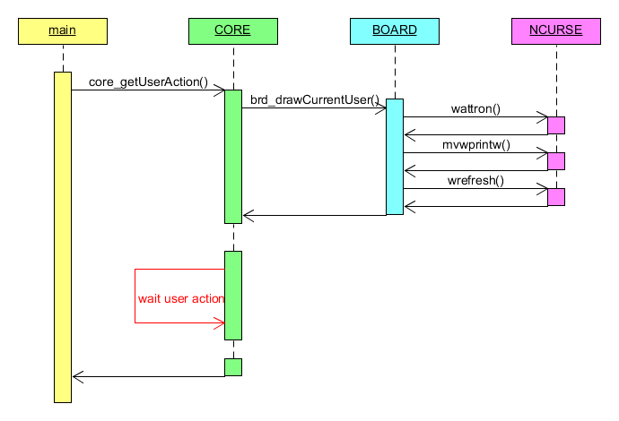

# parchis
Ncurses app to play to this popular game.

# Diagrams

Above some activities diagrams:

Above some sequences diagrams:
## How the system initialize

## Get the action from the user

## Execute the action requested

## Rrefreshing the board

